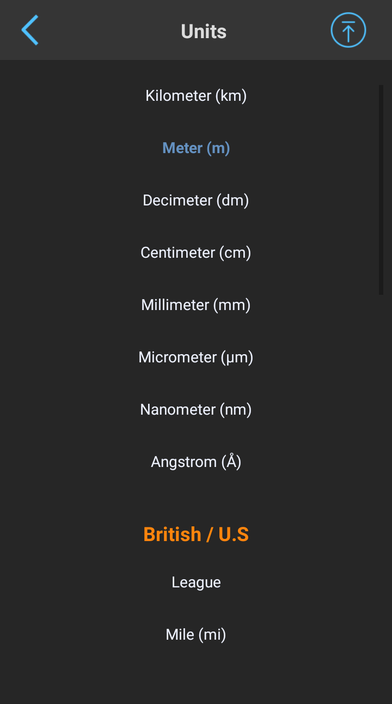

# Convert All

Universal measurement unit conversion tool

### Install on Android
[Google Play](https://play.google.com/store/apps/details?id=com.convertall)

### Exchange rates API
[exchangerate.host](https://exchangerate.host/)

### Features
* U.S., British and metric units.
* 36 measurements: Acceleration, Angle, Area, Bandwidth, Capacitance, Data storage, Density, Dynamic viscosity, Electric charge, Electric current, Electric potential, Electrical conductance, Electrical resistance, Energy, Force, Frequency, Illuminance, Inductance, Kinematic viscosity, Length, Magnetic field, Magnetic flux, Mass, Mass flow rate, Molar Mass, Numerals, Power, Pressure, Radiation, Radioactive decay, Speed, Temperature, Time, Torque, Volume, Volumetric flow rate
* 572 units of measurements
* Currency converter with 168 currencies (rates updated once a day)
* Time zone conversion with 325 different time zones
* Precision selection

### Screenshots
<!---->
     

